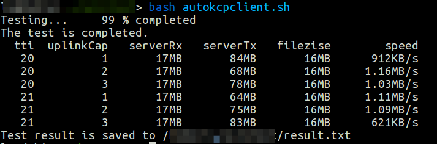

### xray-test
本项目fork自xisk的[v2ray-test](https://github.com/xisk/v2ray-test)。v2ray-test 是自动化测试[v2ray](https://github.com/v2fly/v2ray-core/)在不同KCP参数下的网速的脚本，考虑到该脚本多年未更新，且v2ray的新分支[xray](https://github.com/XTLS/Xray-core)具有取代v2ray的趋势，我将其改为 xray-test。


#### 脚本功能

本项目的脚本可以自动修改 xray 的KCP 配置（仅 tti 和 uplinkCap）并进行测速，以选出更好的配置参数，省去手动测试的烦琐。

脚本在 ubuntu 20.04 测试通过，使用前请阅读以下说明：

- xray 两端须配置好 mKCP 能够正常使用 mKCP 代理
- 脚本通过 SSH 自动修改服务器配置、获取服务器网卡流量信息、重启 xray 等，因此
  - 为正常操作服务器，脚本默认使用root用户登录服务器，未测试非root用户情况下脚本是否正常运行
  - 基于上一条，默认 autokcpserver.sh 的目录为 root 的 home 目录，所以请将 autokcpserver.sh 放到该目录下
- 使用脚本前请修改脚本当中的服务器 SSH 端口、网卡名称、要测试的 tti 及 uplinkCap 的范围，网卡名称请在 autokcpserver.sh 修改
- 脚本默认服务器采用的初始化系统是 systemd，默认服务端 xray 配置文件路径为 /usr/local/etc/xray/config.json
- xray 服务端的配置文件 kcpSttings 中的 tti 及 uplinkCapacity 必须有，脚本只能对这两项的数值进行修改而不会自动添加。为不影响测试结果，请将 xray 两端配置的 downlinkCapacity 设为一个较大的值，例如100
- 脚本默认使用 curl 通过 xray 代理下载 [www.vultr.com](https://www.vultr.com/?ref=6832668) 的大小约为 100MB 的 100MB.bin 进行测试
- 脚本会自动读取 xray 的配置文件，读取的有包括服务器地址、本地代理设置，免去手动输入的麻烦，默认配置文件路径为 /usr/local/etc/xray/config.json，该功能需要安装有软件 jq 
- 脚本会在当前目录产生一些临时数据文件，请确保当前用户对当前目录有读写权限。在测试完成之后脚本自动删除除最终的测试结果之外的临时文件（服务器上的结果文件不会删除）
- 脚本默认仅对每一组 xray 配置参数进行一次测试，理论上不符合统计学的要求，结果仅供参考


由于以上因素，使用此脚本前请配置好自己的机器。对脚本不满意或有特定需要者请自行修改脚本。


#### 推荐配置文件

xray的配置文件可参考[Xray-examples](https://raw.githubusercontent.com/XTLS/Xray-examples)。

- 服务器端：

```json
{
    "log": {
        "loglevel": "warning"
    },
    "inbounds": [
        {
            "protocol": "vless",
            "port": "{{ port }}",
            "settings": {
                "decryption":"none",
                "clients": [
                    {"id": "{{ id }}"}
                ]
            },
            "streamSettings": {
                "network": "kcp",
                "kcpSettings": {
                    "mtu": 1350,
                    "tti": 20,
                    "uplinkCapacity": 2,
                    "downlinkCapacity": 100,
                    "congestion": true,
                    "readBufferSize": 6,
                    "writeBufferSize": 6,
                    "header": {
                        "type": "{{ type }}"
                    },
                    "seed": "{{ seed }}"
                }
            }
        }
    ],
    "outbounds": [
        {"protocol": "freedom"}
    ]
}
```

- 客户端

  ```json
  {
      "log": {
          "loglevel": "warning"
      },
      "inbounds": [
          {
              "port": 1080,
              "listen": "127.0.0.1",
              "protocol": "socks",
              "settings": {
                  "udp": true
              }
          }
      ],
      "outbounds": [
          {
              "protocol": "vless",
              "settings": {
                  "vnext": [
                      {
                          "address": "{{ host }}",
                          "port": "{{ port }}",
                          "users": [
                              {
                                  "id": "{{ uuid }}",
                                  "encryption": "none"
                              }
                          ]
                      }
                  ]
              },
              "streamSettings": {
                  "network": "kcp",
                  "kcpSettings": {
                      "mtu": 1350,
                      "tti": 20,
                      "uplinkCapacity": 2,
                      "downlinkCapacity": 100,
                      "congestion": true,
                      "readBufferSize": 6,
                      "writeBufferSize": 6,
                      "header": {
                          "type": "{{ type }}"
                      },
                      "seed": "{{ seed }}"
                  }
              }
          }
      ]
  }
  ```

  

#### 使用说明:

1. 配置好你的 xray
2. 如果没有 jq 和 curl，请安装
3. 将 autokcpserver.sh 下载至要测试服务器， autokcpclient.sh 下载至PC（Linux）
4. 修改好相关参数，运行 autokcpclient.sh


测试结果中，serverRx 为服务下载文件所花的流量，serverTx 服务器发送给客户端花费的流量。

测试结果示例：



